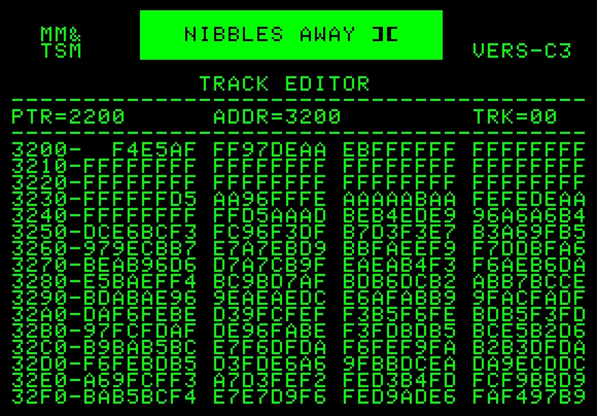
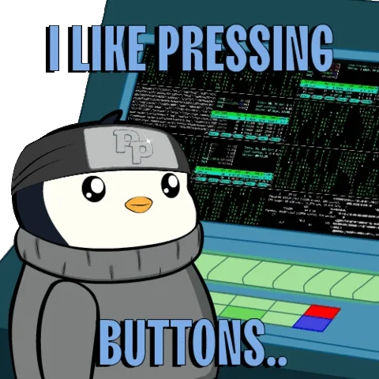
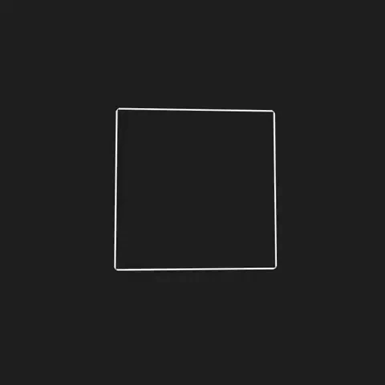

<h2> Hi, I'm David Khauan! </h2>

<p><em>Analytic and Developer System at <a href="https://www.unifor.br/">University of Ceará</a></br>
</em></p>

[](https://www.linkedin.com/in/davidkhauan/)
[](https://github.com/davidkhauan)


###  A little more about me...  

```javascript
const david = {
  pronouns: "he" | "him",
  code: [Javascript, Typescript, HTML, CSS, Java, mySQL],
  tools: [React, Node, Styled-Components, jQuery, Angular, Vue, Ajax, BootStrap],
 challenge: "I am doing the #100DaysOfCode challenge focused on react and javascript"
}
```

 <em><b>I love connecting with different people</b> so if you want to say <b>hi, I'll be happy to meet you more!</b> :)</em>

---
